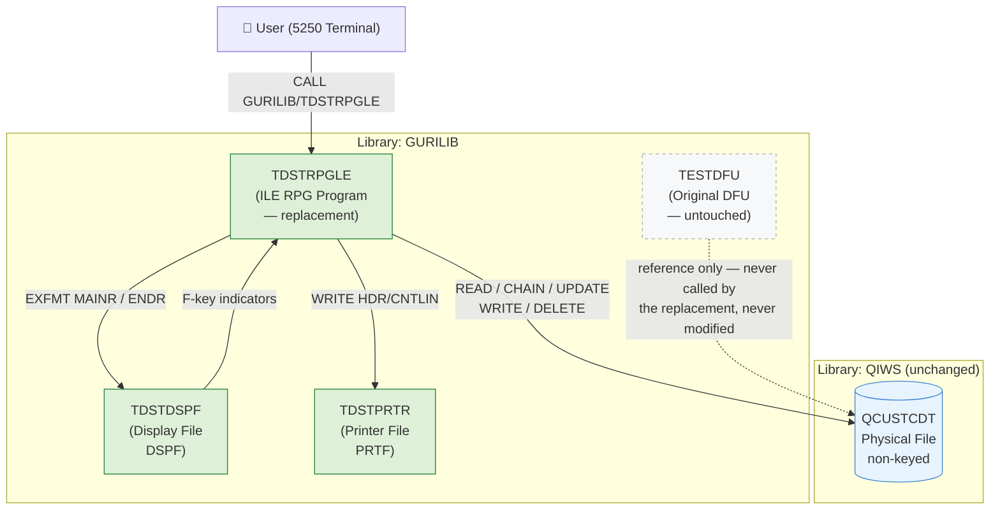
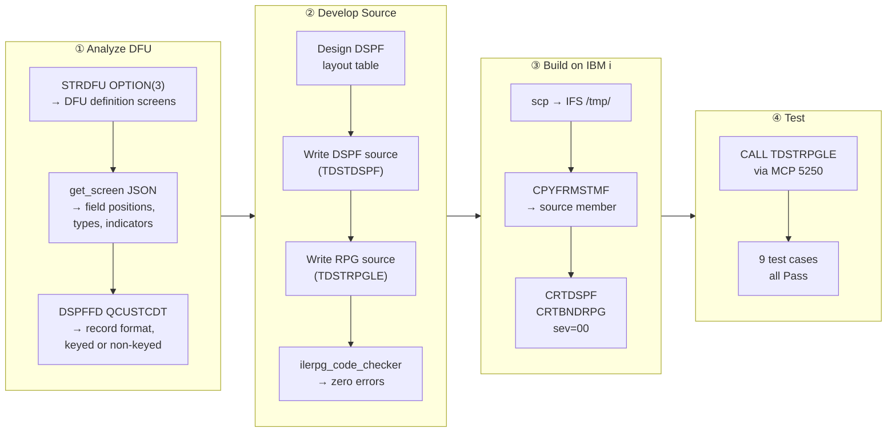
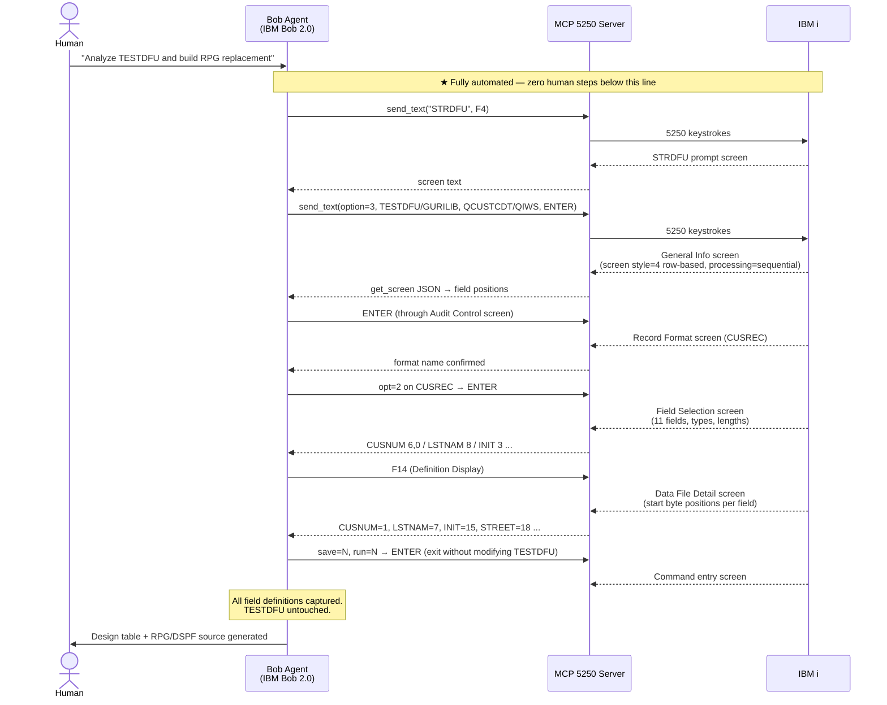
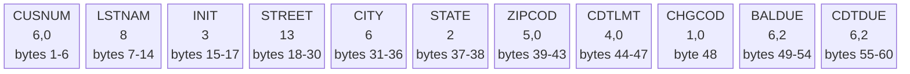
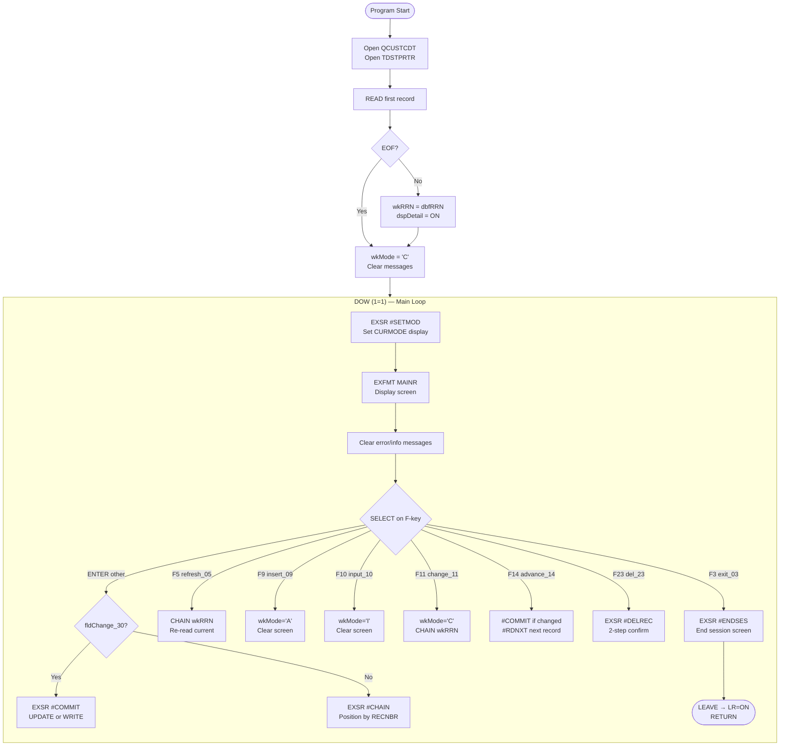
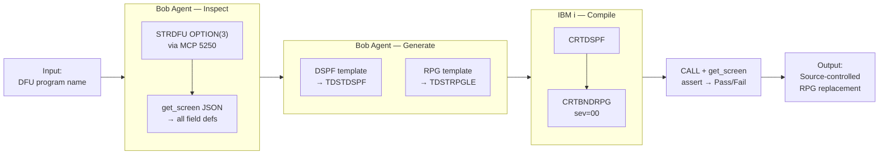
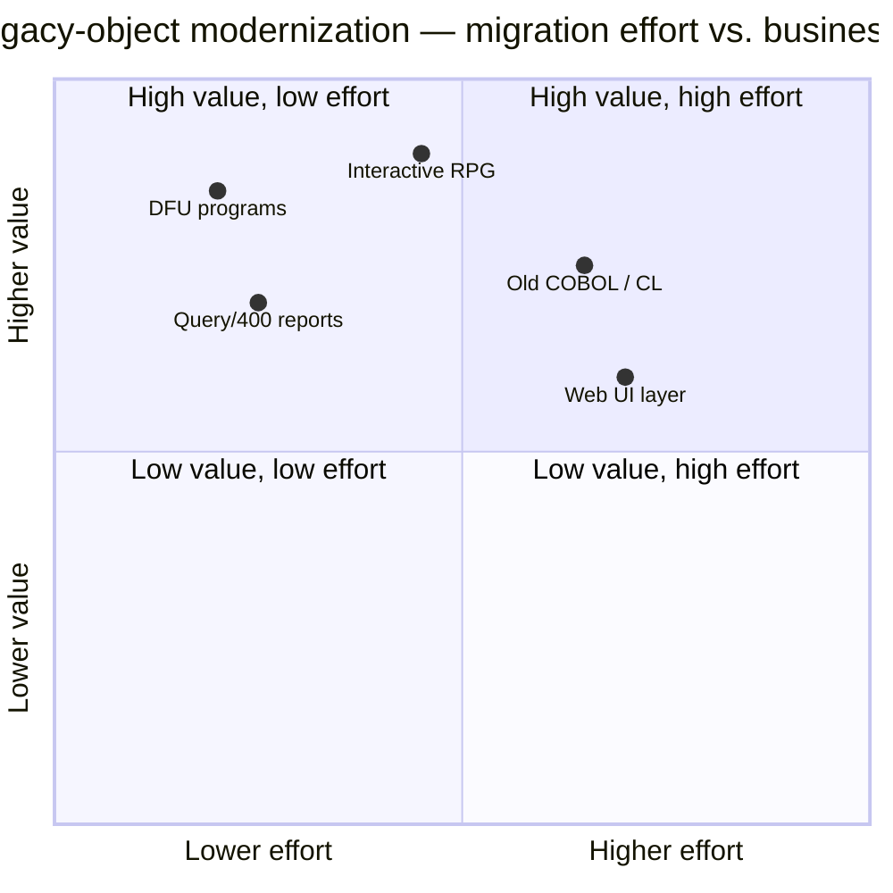

# DFU to ILE RPG + DSPF Migration
## IBM TechXchange 2026 Pre-conference Dev Day Hackathon — Submission Report

**Team / Author:** Guri
**Submission date:** 2026-08-30
**Deadline:** 2026-08-30 10:00 AM ET
**Repository:** <https://github.com/GuriCat/IBM-TechXchange-2026-Dev-Day-Hackathon-DFU-to-ILE-RPG-and-DSPF-Migration>
**Demo video:** <https://youtu.be/B6pJ_TNUvLE> — 7 min, English narration with burned-in subtitles

### Where each required deliverable is

| # | Required deliverable | Location |
|---|---|---|
| 1 | Video demonstration of the solution, including how IBM Bob was used | **YouTube: <https://youtu.be/B6pJ_TNUvLE>** · file [`video/dfu-to-ile-rpg-dspf-migration-demo.mp4`](video/dfu-to-ile-rpg-dspf-migration-demo.mp4) · audio-only [`video/dfu-to-ile-rpg-dspf-migration-demo.mp3`](video/dfu-to-ile-rpg-dspf-migration-demo.mp3) · subtitles [`video/dfu-to-ile-rpg-dspf-migration-demo.srt`](video/dfu-to-ile-rpg-dspf-migration-demo.srt) · script [`docs/demo-script.md`](docs/demo-script.md) |
| 2 | Written problem and solution statements | §1 Problem Statement · §2 Solution Overview |
| 3 | Written statement on how IBM Bob was utilized | §4 How IBM Bob 2.0 Was Used — §4.1 is the agent's own contribution; §4.7 covers watsonx |
| 4 | Working code repository / proof-of-concept evidence | This repository — §9 Deliverables and Source Inventory.  Source parity with the compiled objects on the live IBM i system is verified in §9.1; the task-by-task record of the Bob session is in [`docs/dfu-to-rpgle-plan.md`](docs/dfu-to-rpgle-plan.md), and the demo video shows the Bob task log driving every step. |

---

## 1. Problem Statement

IBM i shops have accumulated hundreds — sometimes thousands — of DFU (Data File Utility)
programs over the decades.  DFU programs are fast to create but impossible to maintain as
source code: they produce no RPG, no DDS, and no comments.  They cannot be unit-tested,
version-controlled, or extended.  They run in their own activation group and have no API.

This has always been inconvenient.  What changed is the deadline.  IBM announced the end of
support for six ADTS components — RLU, SDA, FCMU, APF, CGU and **DFU** — in announcement
`AD24-0477` (published 7 May 2024), effective **30 April 2025**.  For a system of record an
unsupported component in production is not a risk to be monitored; it is a finding waiting
for the next audit.

IBM i 7.6 makes that deadline immediate.  Verified on a live 7.6 system (`V7R6M0`, PTF
`SJ04740` not applied) on 2026-08-30:

> `STRDFU` presents two menu options — *1. Run a DFU program* and *5. Update data using
> temporary program*.  Options 2 (create), 3 (change) and 4 (delete) are absent, and issuing
> the command directly returns `オプション 2, 3, および 4 は使用できません。` ("options 2, 3
> and 4 are not available").

Existing DFU programs keep running.  What is gone is the ability to open one and read what
it does.  PTF `SJ04740` restores options 2–4 and some shops rely on it, but what it restores
is a function IBM no longer supports — a reprieve rather than a commitment.  The planning
consequence is an ordering constraint: **the definitions must be extracted before the release
upgrade, not after it.**

This project was built on IBM i 7.5, where `STRDFU OPTION(3)` still opens a DFU definition.
On an unpatched 7.6 system the same extraction would not
have run at all; on a patched one it would have rested on an unsupported function.

The challenge chosen for this hackathon:

> **Replace `GURILIB/TESTDFU`** (a live DFU program operating on `QIWS/QCUSTCDT`) with a
> functionally equivalent ILE RPG + DSPF application — compiled, source-controlled, and
> behaviorally identical — without touching the original DFU or the data file schema.

> **Note on language in the screen captures.**  `TESTDFU` was created on a
> **Japanese-language IBM i**, so everything DFU itself supplies is rendered in Japanese:
> the DFU definition screens, the runtime function-key legend (`F3=終了`, `F9=挿入` …) and
> the audit-report headings.  Only the column headings come out in English, because those
> are taken from the `COLHDG` text carried by the `QCUSTCDT` fields themselves.  The
> replacement was written in English by choice (see the constraints below), so the
> English/Japanese differences visible in §5.5 are a deliberate localisation change, not a
> shortfall in the reproduction of the layout.

**Constraints imposed (self-enforced to model real-world scenarios):**

| Constraint | Rationale |
|---|---|
| Original `GURILIB/TESTDFU` must remain untouched | Non-disruptive migration path |
| Only `GURILIB` may store new objects | Single-library deployment |
| `QIWS/QCUSTCDT` schema unchanged | Zero data-layer impact |
| All source written in English | Team convention / hackathon requirement |
| Column-limited free-form RPG (no `**FREE`) | Mirrors common legacy shop constraint |

---

## 2. Solution Overview

The replacement consists of three source members compiled into `GURILIB`:

| Object | Type | Source | Description |
|---|---|---|---|
| `GURILIB/TDSTDSPF` | `*FILE *DSPF` | `GURILIB/QDDSSRC(TDSTDSPF)` | 5250 display file — exact DFU screen layout |
| `GURILIB/TDSTPRTR` | `*FILE *PRTF` | `GURILIB/QDDSSRC(TDSTPRTR)` | Printer file — DFU-compatible audit report |
| `GURILIB/TDSTRPGLE` | `*PGM` | `GURILIB/QRPGLESRC(TDSTRPGLE)` | ILE RPG driver program |

**Naming convention:** prefix `TDST` = **T**est**D**FU **ST**ub.

The program is called identically to the original:

```
CALL GURILIB/TDSTRPGLE
```

### 2.1 Solution Architecture



---

## 3. Migration Architecture and Workflow

### 3.1 Four-Phase Workflow

The migration ran as four sequential phases.

**① Analyze** extracts the complete DFU definition.  `STRDFU OPTION(3)` is driven through
the MCP 5250 terminal and `get_screen(format='json')` returns each field's name, type,
length and **start-byte position** as structured data; `DSPFFD` confirms the record format
name and that the file carries no key.  Nothing is written — the DFU is opened read-only
and left exactly as found.

**② Develop** turns those byte positions into a DSPF layout table, and the table into DSPF
and ILE RPG source.  `ilerpg_code_checker` validates the source offline until it reports
zero errors; every issue caught here avoids a 3–5 minute round trip to the IBM i.

**③ Build** copies the source to the IFS with `scp`, promotes it into a source member with
`CPYFRMSTMF ... STMFCCSID(1208)`, and compiles with `CRTDSPF` and `CRTBNDRPG` at severity 0.

**④ Test** calls the compiled program back through the same terminal and exercises nine
functional test cases against live data, reading each result from `get_screen`.

Phases ② and ③ iterate: any compile error is fed back into the source and the loop repeats
until severity 0 is reached.  Phase ① runs once — the captured definition is the fixed
input to everything downstream.



---

## 4. How IBM Bob 2.0 Was Used

**IBM Bob 2.0 built this project.**  The whole migration — reading an undocumented DFU
program, deriving a screen design from it, writing DSPF and ILE RPG source, compiling on
IBM i, diagnosing every compiler error, and running the functional tests — was planned and
executed by the Bob agent inside a single agent session.  The developer supplied the goal
and the constraints; Bob decided the sequence, chose the tools, and closed the loop on each
failure.

Bob drove three tool packages to do it.  The packages provide knowledge and reach; the
decisions, the source code and the diagnoses are Bob's:

| Package | What it provides | How Bob used it |
|---|---|---|
| **Premium Package for i** | IBM i–specific in-context knowledge | Informed Bob's non-keyed RRN design, its `QUALIFIED` root-cause diagnosis and its EBCDIC spool pipeline |
| **ibm5250 MCP** *(separate package)* | Live 5250 terminal access | Bob's hands and eyes on the system: DFU inspection, compile/test cycle, 9 functional tests |
| **ilerpg_code_checker MCP** *(separate package)* | Offline ILE RPG static analysis | Bob's pre-flight check before every upload; eliminated 3–5 min compile round-trips per error |

**IBM Bob 2.0 features used.**  Named as they appear in the IBM Bob documentation
(<https://bob.ibm.com/docs/ide>):

| Feature | How this project used it | Evidence |
|---|---|---|
| **Agent mode** | The migration ran as one autonomous agent session: a single instruction expanded into ~9 `STRDFU` screen navigations, a `DSPFFD` query, repeated static checks, `scp`, `CPYFRMSTMF`, `CRTDSPF`, `CRTBNDRPG`, `CPYSPLF` + `iconv`, and 9 `CALL`-driven test cases — each step chosen from the result of the previous one | §4.1; Bob's task log is on screen throughout the demo video |
| **Plan mode** | Used before implementation to turn the goal into a task-by-task migration plan, which then carried the result of each task as it completed | [`docs/dfu-to-rpgle-plan.md`](docs/dfu-to-rpgle-plan.md) |
| **IBM i Developer mode** *(Premium Package for i)* | Active during the session. Bob switches modes automatically by context, so the split between this mode and the base Agent mode is not recorded — the IBM i–specific decisions it produced are documented individually in §4.2 | §4.2 |
| **External tools via MCP** | Two MCP servers registered to the session and driven as first-class tools: `ibm5250` for the live 5250 terminal, `ilerpg_code_checker` for offline ILE RPG static analysis | `.bob/mcp.json`, quoted below |
| **File access** | Bob authored and revised all three source members directly in the workspace, iterating until `CRTBNDRPG` reported severity 00 | `TDSTRPGLE_v7.rpgle` (7 revisions), `tdstdspf.dspf`, `tdstprtr.prtf` |
| **Run commands** | Shell commands issued from within Bob — `scp` transfers of each source file to the IBM i IFS | §4.5 |
| **Skills** *(Premium Package for i)* | Skills activate automatically from context, so the session does not record which fired; the package's IBM i skill library covers precisely the ground this project had to decide — `rpgle-specs`, `rpg-legacy-specs`, `rpg-data-structures`, `rpg-file-operations`, `rpg-indicators`, `dds-display-files`, `dds-printer-files`, `db2-ccsid-encoding` | §4.2 |

The two MCP servers were registered to the Bob session as follows.  `.bob/` is excluded
from the repository, so the file is reproduced here in full:

```json
{
  "mcpServers": {
    "ibm5250": {
      "command": "…\\ibm5250-mcp\\ibm5250-mcp-windows-x64.exe"
    },
    "ilerpg_code_checker": {
      "command": "node",
      "args": ["…\\ilerpg-code-checker\\build\\index.js"]
    }
  }
}
```

### 4.1 What the Bob Agent Itself Did

The four contributions below are the agent's own work — they are not supplied by any of the
packages above, which offer knowledge, a terminal and a linter respectively.

**Planned the migration and held the plan across the whole session.**  Bob derived the
four-phase workflow in §3.1 from the goal alone, and kept the captured DFU definition as the
fixed input to every downstream decision — the DSPF layout, the RPG field definitions and
the test cases all trace back to the single `get_screen` capture in phase ①.

**Orchestrated the tools autonomously.**  A single instruction — *"analyse TESTDFU and build
an RPG replacement"* — expanded into roughly nine `STRDFU` screen navigations, a `DSPFFD`
query, repeated `check_rpg_file` runs, `scp` transfers, `CPYFRMSTMF`, `CRTDSPF`, `CRTBNDRPG`,
spool retrieval with `CPYSPLF` + `iconv`, and nine `CALL`-driven test cases.  Bob chose which
tool to use at each step and read each result before deciding the next.  No step was
scripted in advance by the developer.

**Diagnosed root causes rather than patching symptoms.**  Each compile returned a *batch* of
errors; Bob identified the single underlying cause of each batch and fixed it in one turn,
instead of editing errors one at a time:

| Error batch | Root cause identified | Fix applied |
|---|---|---|
| `RNF7030` (all indicators undefined) | `ws DS` missing `QUALIFIED` | Added `QUALIFIED` |
| `RNF7030` (`QCUSTCDTR` undefined) | Wrong record format name | `QCUSTCDTR` → `CUSREC` |
| `RNF7075` (keyed op on non-keyed file) | `QCUSTCDT` has no key | Removed `K`, rewrote to RRN |

The `RNF7030` batch is the clearest case: over thirty "undefined name" errors across every
indicator reference had one cause — a missing `QUALIFIED` keyword on the `ws` data
structure — and one fix.

**Iterated to a clean build and verified its own work.**  Bob repeated edit → check →
upload → compile until `CRTBNDRPG` reported severity 00, then ran the nine functional tests
through the live terminal and read each result back from `get_screen` to confirm the
expected screen state — rather than treating "it compiled" or "the screen appeared" as
success.  Seven source revisions were produced along the way; only the final one is in the
repository.

### 4.2 Premium Package for i — IBM i Knowledge

> **The Premium Package for i** provides IBM i–specific in-context knowledge to the Bob
> agent — covering RPG language rules, DDS syntax, CL commands, system APIs, and
> IBM i–specific development patterns.  Without it the base Bob agent handles IBM i as a
> generic platform, and nuanced platform constraints must be discovered through trial and
> error.

The following are concrete instances in this project where the Premium Package knowledge
determined the correct outcome directly:

**Non-keyed file navigation — the central design decision**

When `DSPFFD` output showed no key field on `QCUSTCDT`, Bob produced this three-part
design decision in a single response:

1. The F-spec must omit `K` (non-keyed file — keyed ops will fail at compile)
2. All navigation must use `CHAIN(E) rrn CUSREC` with explicit RRN
3. The current RRN must be captured from `INFDS` offset 397–400 (`4I 0`) after each I/O

All three were correct and together constitute the complete solution to the non-keyed
constraint.  A developer without IBM i background would have discovered each through a
separate compile error or documentation search.

**`INDDS(ws)` + `QUALIFIED` — root cause of 30+ `RNF7030` errors**

When the first compile returned 30+ `RNF7030` (undefined name) errors across all
indicator references, Bob identified the root cause in one turn: the `ws` DS declared
with `INDDS` requires the `QUALIFIED` keyword in column-limited free-form RPG.
Without `QUALIFIED`, every reference such as `ws.exit_03` is parsed as a qualified
reference to an undefined structure.  This is a narrow IBM i–specific interaction;
the fix (`QUALIFIED` added to the DS definition) resolved all 30+ errors at once.

**`CPYSPLF` → IFS → `iconv` — reading EBCDIC spools as UTF-8**

Compile spools on IBM i are written in EBCDIC (CCSID 939 on this Japanese system).
Bob prescribed the complete pipeline without prompting:

```
CPYSPLF FILE(TDSTRPGLE) TOFILE(*TOSTMF) TOSTMF('/tmp/cmp.txt') STMFOPT(*REPLACE)
QSH CMD('iconv -f IBM-939 -t UTF-8 /tmp/cmp.txt > /tmp/cmp_utf8.txt')
```

This requires knowing: (a) `CPYSPLF` writes to the IFS through `TOFILE(*TOSTMF)` with the
path in `TOSTMF` and the replace option in `STMFOPT` — **not** `TOMBR`/`MBROPT`, which are
the database-member parameters; (b) `CPYSPLF` has **no** `STMFCCSID` parameter, so the
stream file is written in the spool's own EBCDIC CCSID and a conversion step is
unavoidable; and (c) `iconv` with the IBM-939 source tag produces readable UTF-8 on a
Japanese IBM i.  None of these are general Linux knowledge.

**Column-limited free-form RPG — consistent throughout**

Every generated source file used the correct column-limited free-form style: 5-space
indent for H/F/D specs, 7-space indent for C-specs and `BEGSR`/`ENDSR`, `/free`…`/end-free`
boundaries for free-form blocks.  `**FREE` was never generated.  This constraint was
respected without reminders across all seven source versions.

### 4.3 MCP 5250 (`ibm5250`) — Live IBM i Terminal Access

> **The `ibm5250` MCP server is a separate package**, independent of the Premium Package
> for i.  It gives the Bob agent a live 5250 terminal connection to IBM i — enabling it
> to navigate green-screen applications, run CL commands, and read screen output as
> structured JSON, all from within the agent session.

**During DFU analysis:**

Bob drove `STRDFU OPTION(3)` autonomously through the IBM i terminal, navigated every
definition screen, and captured all field data without human involvement:

- `get_screen(format='json')` returned field positions (row/col), types, lengths,
  indicator bindings, and protection attributes as machine-readable JSON — replacing
  ~30 minutes of manual screen reading and hand-transcription
  (see the effort comparison in §4.6).
- `DSPFFD FILE(QIWS/QCUSTCDT)` was issued directly from the terminal prompt and its
  output confirmed `CUSREC` as the format name and revealed the non-keyed structure —
  a critical constraint that shaped the entire RPG design.

**During compile and test:**

- `CPYFRMSTMF`, `CRTDSPF`, `CRTBNDRPG` — all run via MCP 5250 terminal commands.
- `CPYSPLF` + `iconv` pipeline executed via `QSH` to retrieve compile errors as UTF-8.
- All 9 functional tests exercised through `send_text` / `send_key` on the live terminal;
  results verified from `get_screen` output — no human needed at the screen.

### 4.4 ILE RPG Code Checker MCP (`ilerpg_code_checker`)

> **The `ilerpg_code_checker` MCP server is a separate package**, independent of the
> Premium Package for i.  It performs static analysis of ILE RPG source files locally —
> column positions, spec order, naming conventions, and best-practice checks — without
> requiring an IBM i connection.

Before each upload to IBM i, Bob ran:

```
check_rpg_file(path='TDSTRPGLE_vN.rpgle', checkLevel='standard')
```

Issues caught offline before the IBM i compile cycle:

- `ws DS` missing `QUALIFIED` — would have produced 30+ `RNF7030` at compile
- `*OPCODE` field at wrong column in D-spec — positional error invisible in a text editor
- `BEGSR`/`ENDSR` exceeding column 80 — column-limit violation

**Time saving:**  Without this MCP, each issue required: edit → `scp` → `CPYFRMSTMF`
→ `CRTBNDRPG` → retrieve spool → read error → diagnose — approximately **3–5 minutes
per cycle**.  The offline checker returned results in **under 5 seconds**.

### 4.5 SSH + SCP — File Transfer

Local source files were transferred to the IBM i IFS via `scp` (public-key auth), then
promoted to source members with `CPYFRMSTMF ... STMFCCSID(1208)`, letting IBM i perform
UTF-8 → CCSID 37 conversion automatically on ingest.

### 4.6 Automated DFU Inspection by Bob — vs. Manual Effort

#### How Bob Extracted the DFU Definition Automatically

Bob drove `STRDFU OPTION(3)` through the MCP 5250 terminal, navigated every definition
screen, and captured structured field data in a single agent turn — with no human
interaction required.



#### Effort Comparison: Bob Automated vs. Manual

The same information gathering done manually by an experienced IBM i developer would
require the following steps:

```mermaid
gantt
    title DFU Definition Extraction — Bob Automated vs. Manual
    dateFormat  HH:mm
    axisFormat  %H:%M

    section Bob (Automated)
    STRDFU navigate + get_screen capture  :done, bob1, 00:00, 3m
    Field table generation from JSON      :done, bob2, after bob1, 2m
    DSPF layout design                    :done, bob3, after bob2, 5m
    Total Bob effort                      :crit, 00:00, 10m

    section Manual (Experienced Developer)
    Open DFU in STRDFU option 3           :man1, 00:00, 5m
    Hand-copy field names + types         :man2, after man1, 15m
    Note byte positions from F14 screen   :man3, after man2, 10m
    Cross-check with DSPFFD output        :man4, after man3, 10m
    Draw DSPF layout on paper/spreadsheet :man5, after man4, 20m
    Total manual effort                   :crit, 00:00, 60m
```



Both columns below are **wall-clock time**, measured the same way on both sides.  Bob's
figures include agent reasoning and MCP round-trips, not just keystroke transmission —
the demo recording shows the STRDFU navigation alone taking ~75 seconds of live 5250
interaction.  Rows map one-to-one onto the Gantt chart above.

| Activity | Bob (Automated) | Manual (Experienced Dev) | Saving |
|---|---|---|---|
| Navigate STRDFU screens and capture every field definition | **~3 min** — one agent pass; `get_screen(json)` returns names, types, lengths **and** start-byte positions together | ~30 min (~5 min navigate + ~15 min hand-copy names/types + ~10 min transcribe F14 byte positions) | ~27 min |
| Build the field table and cross-check against `DSPFFD` | **~2 min** (generated from the captured JSON) | ~10 min (manual cross-check) | ~8 min |
| Design DSPF layout table | **~5 min** (derived from the byte-position data) | ~20 min (spreadsheet/paper) | ~15 min |
| **Total** | **~10 min** | **~60 min** | **~50 min (83% reduction)** |
| Error rate | Near-zero (machine-read) | Human transcription errors likely | ✅ |
| Reproducibility | 100% repeatable, any DFU | Requires skilled developer each time | ✅ |

> **Key insight:** The `get_screen(format='json')` API returns every field's row, col,
> length, type, and indicator binding as machine-readable structured data in a single
> pass.  A human reading the same 5250 screens must manually transcribe each value —
> introducing transcription errors and taking **6× longer**.  For a shop with
> **300 DFU programs**, this single capability difference represents
> **~250 hours of saved analysis effort**.

> **Both columns assume a release on which the DFU definition can still be opened.**  On IBM
> i 7.6 the option is missing until PTF `SJ04740` is applied, and a developer working by hand
> hits exactly the same block that Bob does — the constraint is the release, not the method.
> The comparison above is therefore Bob versus a human on IBM i 7.5.  The PTF does restore the
> option, so the work stays possible on 7.6; what it restores is a function that left support
> on 30 April 2025, which makes it a poor foundation for a migration schedule.

---

### 4.7 IBM watsonx — Not Used

**Neither watsonx.ai nor watsonx Orchestrate was used in this solution**, and no IBM Cloud
services were used.  The problem is an on-premises IBM i code-migration task: the inputs are
DFU definition screens and a physical file layout, and the outputs are compiled `*PGM` and
`*FILE` objects in a library.  There is no inference workload to host and no cross-system
workflow to orchestrate.  The IBM i domain knowledge the task needed was already available
to the agent through the Premium Package for i inside the Bob session, so routing any part
of the work to a cloud inference service would have added latency and a dependency without
contributing to the result.

This is a deliberate choice rather than an omission — the contest rules make watsonx
optional and IBM Bob mandatory:

> "…establish an IBM Bob account and **optionally** establish an IBM Cloud Account with
> access to watsonx services provided by IBM for the sole purposes of participation in the
> Contest…"
>
> "All Submissions are **required to make use of IBM Bob** to be eligible for Prizes.
> Submissions **may also optionally** use additional IBM Cloud services or other IBM
> technologies."
>
> — *IBM TechXchange 2026 Pre-conference Dev Day Hackathon, Official Rules*
> (REQUIREMENTS FOR USE OF IBM TECHNOLOGY; ENTRY REQUIREMENTS)

The mandatory technology — IBM Bob — is used throughout and documented feature by feature
in §4 above.

## 5. Technical Implementation

### 5.1 QCUSTCDT File Analysis

A critical discovery made during implementation:

> `QIWS/QCUSTCDT` is a **non-keyed physical file**.  Access is by **Relative Record Number
> (RRN)** only — not by key field.  This matches the DFU `*RECNBR` navigation model exactly.

This meant the RPG F-spec must omit `K` (keyed), and all navigation uses:

- `READ(E) CUSREC` — sequential forward
- `CHAIN(E) rrn CUSREC` — direct RRN access
- `CHAIN(E) 1 CUSREC` — wrap to first record on EOF
- Current RRN tracked in `wkRRN` via `INFDS` offset 397–400 (`dbfRRN`)

#### QCUSTCDT Record Layout



### 5.2 Display File (TDSTDSPF)

Key DDS design decisions:

| Feature | Implementation |
|---|---|
| Indicator management | `INDARA` at file level; `INDDS(ws)` in RPG F-spec |
| Mode title (row 1) | Output field `CURMODE 7A` — "Change ", "Input  ", "Insert " |
| Record number input (row 4) | `RECNBR 6Y 0B` with `CHECK(RB)` — right-blank adjust |
| Detail-section visibility | `IN60` — controls all data fields on/off |
| Delete confirmation | `IN61` — adds `DSPATR(PR)` + `DSPATR(RI)` to all data fields |
| Change detection | `CHANGE(30)` — sets `IN30` when any input field is modified |
| Error message (row 24) | `MSGDTA 78A` with `COLOR(RED)` gated by `IN50` |
| Info message (row 24) | `MSGDTB 78A` with `COLOR(GRN)` gated by `IN51` |
| Two record formats | `MAINR` (data entry) + `ENDR` (end-of-session confirmation) |

Function key bindings on `MAINR`:

| Key | DDS | Indicator | Action |
|---|---|---|---|
| F3 | `CA03(03)` | IN03 | Exit → end-of-session screen |
| F5 | `CF05(05)` | IN05 | Refresh — re-read current record |
| F9 | `CF09(09)` | IN09 | Switch to Insert mode |
| F10 | `CF10(10)` | IN10 | Switch to Input mode |
| F11 | `CF11(11)` | IN11 | Switch to Change mode |
| F14 | `CF14(14)` | IN14 | Advance — commit + read next |
| F23 | `CA23(23)` | IN23 | Delete confirmation |

### 5.3 RPG Program (TDSTRPGLE)

**Specification style:** Column-limited free-form.  
H/F/D specs use 5-space indent; subroutine headers (`BEGSR`/`ENDSR`) use 7-space indent.
No `**FREE` directive — compatible with the majority of legacy ILE RPG shops.

**File declarations:**

```rpg
     FQCUSTCDT  UF A E             DISK    USROPN INFDS(dbfds)
     F                                     INFSR(#DBEX)
     FTDSTDSPF  CF   E             WORKSTN INDDS(ws)
     FTDSTPRTR  O    E             PRINTER USROPN
```

Note: `K` is intentionally absent — non-keyed file access.

**Indicator DS (`ws`) — QUALIFIED:**

```rpg
     Dws               DS                  QUALIFIED
     D  exit_03                        N   OVERLAY(ws : 3)
     D  refresh_05                     N   OVERLAY(ws : 5)
     D  insert_09                      N   OVERLAY(ws : 9)
     D  input_10                       N   OVERLAY(ws : 10)
     D  change_11                      N   OVERLAY(ws : 11)
     D  advance_14                     N   OVERLAY(ws : 14)
     D  cancel_12                      N   OVERLAY(ws : 12)
     D  del_23                         N   OVERLAY(ws : 23)
     D  fldChange_30                   N   OVERLAY(ws : 30)
     D  errorMsg_50                    N   OVERLAY(ws : 50)
     D  infoMsg_51                     N   OVERLAY(ws : 51)
     D  dspDetail_60                   N   OVERLAY(ws : 60)
     D  fieldRI_PR_61                  N   OVERLAY(ws : 61)
```

**RRN tracking via INFDS:**

```rpg
     Ddbfds            DS
     D  dbfStatus             11     15
     D  dbfOpr           *OPCODE
     D  dbfRRN               397    400I 0
```

After every successful I/O that positions the file, `wkRRN = dbfRRN` captures the current RRN.

#### 5.3a RPG Main Loop Flow



**Main loop logic (abbreviated):**

```rpg
        DOW (1 = 1);
          EXSR #SETMOD;
          EXFMT MAINR;
          SELECT;
            WHEN ws.exit_03;    EXSR #ENDSES; LEAVE;
            WHEN ws.refresh_05; CHAIN(E) wkRRN CUSREC; ...
            WHEN ws.insert_09;  wkMode = 'A'; EXSR #CLRSCR; ...
            WHEN ws.input_10;   wkMode = 'I'; EXSR #CLRSCR; ...
            WHEN ws.change_11;  wkMode = 'C'; CHAIN(E) wkRRN CUSREC; ...
            WHEN ws.advance_14; EXSR #COMMIT; EXSR #RDNXT;
            WHEN ws.del_23;     EXSR #DELREC;
            OTHER;
              IF ws.fldChange_30; EXSR #COMMIT;
              ELSE;               EXSR #CHAIN;
              ENDIF;
          ENDSL;
        ENDDO;
```

**Subroutine summary:**

| Subroutine | Purpose |
|---|---|
| `#SETMOD` | Maps `wkMode` ('C'/'I'/'A') to 7-char `CURMODE` display field |
| `#CLRSCR` | Clears record buffer, hides detail section |
| `#CHAIN` | Positions to RRN entered in `*RECNBR` field |
| `#COMMIT` | UPDATE (Change) or WRITE (Input/Insert) with error handling |
| `#RDNXT` | READ next; wraps to RRN=1 on EOF with info message |
| `#DELREC` | Two-step F23 delete with field protection confirm |
| `#ENDSES` | Displays ENDR screen, calls `#PRTRPT` if confirmed |
| `#PRTRPT` | Writes DFU-format audit report to TDSTPRTR |
| `#DBEX` | INFSR handler — displays DB error, sets `returnPt='*CANCL'` |

### 5.4 Audit Report (TDSTPRTR)

The audit report reproduces the three-section structure of the DFU audit report
(header / count lines / end trailer).  The listing below is the **verbatim spool
produced by the demo recording**, retrieved from the live system with
`CPYSPLF FILE(TDSTPRTR) TOFILE(*TOSTMF) TOSTMF(...) STMFOPT(*REPLACE)` and converted
from EBCDIC — job `969643/E00522/QPADEV0003`, 2026-08-29 21:22:52:

```
  5770SS1  V7R5M0  220415              Audit Log 26/08/   21:22:52 Page      1
   Pgm/Lib . . GURILIB/TDSTRPGLE
   Member . . . . QCUSTCDT
   Job Title . . TESTDFU
                    1 records added
                    1 records changed
                    1 records deleted
    * * * DFU AUDIT REPORT END * * *
```

The three counts (1 added / 1 changed / 1 deleted) are the operations performed in the
demo video, confirming the audit counters track every record operation.

> **Known defect:** `HDRDAT` is declared `6A` in `TDSTPRTR` while the program assigns
> `%CHAR(%DATE() : *YMD/)`, which is 8 characters — so the date prints truncated as
> `26/08/` instead of `26/08/29`.  See §8 Limitations.

### 5.5 Side-by-Side Comparison: Original DFU vs. TDSTRPGLE

#### Screen Layout

Both screens were captured with MCP 5250 `get_screen` on the live system.  The original DFU
screen was obtained by **running** `GURILIB/TESTDFU` once in a dedicated inspection
session purely to record its layout; running a DFU program does not alter it, and the
program object was never re-created, re-compiled or otherwise modified (see §2, where
`TESTDFU` is marked *never called by the replacement*).

**Original DFU (`GURILIB/TESTDFU`)**

```
 TESTDFU                                        Change
 Format  . . . . :   CUSREC        File  . . :   QCUSTCDT

*RECNBR:        0

Number  Last Name Initial
------  --------- -------
 938472  HENNING     G K

Street        City   State Zip   Code
------------- ------ ----- --------
 4859 ELM AVE  DALLAS  TX    75217

Credit Limit Assessment Code  Balance   Accounts Receivable
------------ ---------------  --------- -------------------
    5,000           3            37.00            .00


 F3=終了  F5=最新表示  F9=挿入  F10=入力  F11=変更  F14=前進  F23=削除
```

**Replacement (`GURILIB/TDSTRPGLE`)**

```
 TESTDFU                                        Change
 Format  . . . . :   CUSREC        File  . . :   QCUSTCDT

*RECNBR:

Number  Last Name Initial
------  --------- -------
 938472  HENNING     G K

Street        City   State Zip   Code
------------- ------ ----- --------
 4859 ELM AVE  DALLAS  TX    75217

Credit Limit Assessment Code  Balance   Accounts Receivable
------------ ---------------  --------- -------------------
    5,000           3            37.00            .00


 F3=Exit  F5=Refresh  F9=Insert F10=Input  F11=Change  F14=Advance  F23=Delete
```

**Differences noted:**

| Item | Original DFU | TDSTRPGLE | Impact |
|---|---|---|---|
| Function key labels (row 23) | Japanese (`F3=終了` etc.) | English (`F3=Exit` etc.) | Cosmetic only |
| `*RECNBR` initial value | Shows `0` | Blank | Both accept numeric RRN input |
| Screen title row 1 | `TESTDFU` + mode | `TESTDFU` + mode | Identical |
| All data fields | Identical layout | Identical layout | ✅ Exact match |
| Field positions | Identical | Identical | ✅ Exact match |

#### Audit Report

**Original DFU (`GURILIB/TESTDFU`) — from reference spool**

```
  5770SS1     V7R5M0  220415          監査ログ          26/08/08   12:58:22  ページ   1
    プログラム/ライブラリー . . . .   DFUX/WIDEP2
   メンバー . . . . . .   WIDEP2
   ジョブ・タイトル . .   WIDE02
                      0  レコードが追加された
                      0  レコードが変更された
                      0  レコードが削除された
                         * * * * * D F U 監　査　報　告　書　の 終　わ　り * * * * *
```

**Replacement (`GURILIB/TDSTRPGLE`) — verbatim spool from the demo run**

```
  5770SS1  V7R5M0  220415              Audit Log 26/08/   21:22:52 Page      1
   Pgm/Lib . . GURILIB/TDSTRPGLE
   Member . . . . QCUSTCDT
   Job Title . . TESTDFU
                    1 records added
                    1 records changed
                    1 records deleted
    * * * DFU AUDIT REPORT END * * *
```

**Differences noted:**

> **Note on the reference:** `GURILIB/TESTDFU` has no audit spool of its own on this
> system, so the left-hand listing is a genuine DFU audit spool from a *different* DFU
> program on the same machine (`DFUX/WIDEP2`, captured 2026-08-08).  It is used purely as
> the format reference — the counts are its own, not TESTDFU's.

| Item | Original DFU | TDSTRPGLE | Impact |
|---|---|---|---|
| Product code header | `5770SS1` | `5770SS1` | ✅ Identical |
| Language | Japanese | English | Intentional (hackathon convention) |
| Program / member / job-title lines | 3 lines, labelled | 3 lines, labelled | ✅ Same structure |
| Count lines | 3 lines, value right-justified | 3 lines, value right-justified | ✅ Identical layout |
| End trailer | `* * * * * D F U 監査報告書の終わり * * * * *` | `* * * DFU AUDIT REPORT END * * *` | Abbreviated English form |
| Structure (header / counts / footer) | 3-section | 3-section | ✅ Identical structure |
| Date field | `26/08/08` | `26/08/` | ⚠️ Truncation defect — see §8 |

---

## 6. Test Results

All tests passed against live `QIWS/QCUSTCDT` data on the IBM i system.

| Test | Operation | Result |
|---|---|---|
| T1 | Initial display (RRN=1, HENNING) | ✅ Pass |
| T2 | F14 Advance to next record (JONES) | ✅ Pass |
| T3 | `*RECNBR` = 5 → direct RRN access (TYRON) | ✅ Pass |
| T4 | Change mode: edit LSTNAM, ENTER → update | ✅ Pass |
| T5 | F5 Refresh: re-reads current record | ✅ Pass |
| T6 | F9 Insert: blank screen, enter data → add | ✅ Pass |
| T7 | F23 Delete: confirm with F23 → delete | ✅ Pass |
| T8 | F23 Delete: cancel with ENTER → no delete | ✅ Pass |
| T9 | F3 → End screen (Added=1, Changed=1, Deleted=1) → Y → audit report | ✅ Pass |

**Final compile status:** `CRTBNDRPG` — maximum severity **00** (no errors, no warnings).

---

## 7. Further Deployment Ideas, Extensions, and Business Value

### 7.1 Automated DFU-to-RPG Conversion Tooling — highest value



IBM i shops commonly have **hundreds of DFU programs**.  The pattern proved here is
fully repeatable:

```
STRDFU OPTION(3) → get_screen(json) → generate DSPF+RPG skeleton → CRTDSPF+CRTBNDRPG → test
```

A Bob skill (or standalone MCP tool) wrapping this loop could:
1. Accept a DFU program name as input
2. Invoke `STRDFU OPTION(3)` via MCP 5250 and capture all field positions in one pass
3. Emit a compilable DSPF + RPG skeleton from a Jinja/Handlebars template
4. Compile, run a functional test via `CALL`, and report pass/fail — all unattended

**Business value:** A shop with 300 DFU programs could migrate them in days rather than
years, with full source control and zero behavioral regression.

### 7.2 Web UI / REST API Layer

Now that CRUD logic is in source-controlled RPG, adding an HTTP interface requires no
data-layer changes:

- **Short term:** ILE RPG + `QZHBCGI` CGI handler exposes the same operations as a
  simple web form — replacing the green screen without changing any business logic.
- **Medium term:** Open Source Node.js or Python on IBM i wraps the RPG via `QCMDEXC`
  or Db2 SQL, delivering a REST JSON API consumable by modern front-ends.
- **Long term:** IBM Host Access Transformation Services (HATS) or Profound UI can
  further modernize the 5250 screen to a responsive web UI with minimal code changes.

### 7.3 CI/CD Pipeline Integration

The compile-test loop demonstrated in this project maps directly to a CI/CD pipeline:

```
git push → webhook → Bob agent → scp+CPYFRMSTMF → CRTBNDRPG → CALL+get_screen assert → pass/fail
```

This gives IBM i RPG the same DevOps practices (automated build, automated test,
pull-request gate) enjoyed by Java or Node.js projects — with no new IBM i infrastructure.


### 7.4 Db2 for i / SQL Modernization

With data access encapsulated in RPG source, the upgrade path to SQL is a one-file
change:

- Replace physical file I/O with `EXEC SQL SELECT / UPDATE / INSERT / DELETE`
- Gain row-level security, triggers, referential integrity, and journaling
- Enable Db2 Web Query / ACS Run SQL Scripts reporting on the same table

### 7.5 Broader IBM i Modernization Pattern — Applicability

**How to read this chart.**  The horizontal axis is the **effort to migrate one object**
with the toolchain demonstrated in this project — inspect it, generate source, compile,
test.  The vertical axis is the **value the shop gets back**: source control, testability,
maintainability, and removal of a single-point-of-failure skill dependency.  The top-left
quadrant is where the work pays back fastest.



**DFU programs sit in the top-left quadrant** — low effort because DFU exposes a complete,
machine-readable definition through `STRDFU`, high value because the result is ordinary
source-controlled RPG.  Interactive RPG with no source scores higher still on value, but
costs more effort: its behaviour has to be inferred from screens rather than read from a
definition.  A web UI layer is the opposite — real effort, and it adds presentation rather
than maintainability, so it belongs after the source-recovery work, not before it.

The DFU case is one instance of a wider class of **"no-source legacy objects"** on IBM i:

| Legacy object | Same Bob approach applies? |
|---|---|
| DFU programs | ✅ Demonstrated in this project |
| Interactive RPG (fixed-format, no source) | ✅ MCP 5250 inspection + RPG checker |
| Query/400 reports | ✅ Inspect output, generate SQL or RPG equivalent |
| Old COBOL/CL with no maintainer | ✅ Bob agent can read, refactor, document |

**The toolchain built here — MCP 5250 + ilerpg_code_checker + Bob agent reasoning —
is a general-purpose IBM i modernization platform**, not a single-use DFU tool.

---

## 8. Lessons Learned and Limitations

### Lessons Learned

1. **Non-keyed PF is the norm for old DFU files.**  Never assume a DFU target file has a
   key.  `DSPFFD` before writing any F-spec is mandatory.

2. **`QUALIFIED` on indicator DS is non-optional.**  Without it, `ws.exit_03` is parsed as
   a qualified reference to an undefined structure, producing dozens of `RNF7030` errors.

3. **`%RRN` does not work on non-keyed files in column-limited free-form.**  Use `INFDS`
   offset 397–400 (`4I 0`) instead.

4. **MCP 5250 `get_screen(format='json')` is the definitive source of truth** for field
   positions, types, and indicator bindings — faster and more accurate than reading DDS
   source or documentation.

5. **`CPYSPLF` has no `STMFCCSID` parameter at all** (verified with a live `CPD0043`
   on the live system) — unlike `CPYTOSTMF`/`CPYFRMSTMF`.  The stream file therefore always
   lands in the spool's EBCDIC CCSID, and QSH `iconv` on the IBM i side (not on the PC
   side) is the only way to get readable UTF-8 for error analysis.  The stream-file
   path goes in `TOSTMF` and the replace option in `STMFOPT`; `TOMBR`/`MBROPT` are the
   database-member parameters and fail with `CPD0074` if a path is passed.

### Limitations

- **The extraction method depends on `STRDFU OPTION(3)`.**  Phase ① captures the DFU
  definition by opening it on a live terminal, which requires menu option 3.  On IBM i 7.6
  without PTF `SJ04740` that option is missing (see §1), so this workflow does not run there
  as-is.  Applying the PTF brings it back and the workflow runs again, but it then depends on
  a function that has been out of support since 30 April 2025 — workable, not advisable.
  Where the option is missing, `DSPFFD` still yields the physical-file field definitions, but
  the DFU-side screen
  layout, function-key assignments and audit-report format — everything that exists only
  inside the DFU object — cannot be recovered.  This is the practical argument for migrating
  before the release upgrade rather than after it.
- **Only the common subset of DFU function is covered.**  `TESTDFU` uses a single record
  format, and it uses neither field duplication nor automatic numbering.  The replacement
  implements none of those, because the original does not need them.  They are the less
  frequently used parts of DFU, but across several hundred programs a shop will own some,
  and each one adds conversion work that this project did not have to do.
- **`*RECNBR` is RRN, not CUSNUM.**  The replacement preserves this DFU behavior: row-4
  input navigates by physical record position, not by customer number.  A future version
  could add an SQL `WHERE CUSNUM = :n` lookup for key-based navigation.
- **No journaling / commitment control.**  The original DFU ran without journaling; the
  replacement matches this.  Adding `STRCMTCTL` is a one-line change.
- **Audit report is English-only.**  The original DFU report is in Japanese.  A production
  migration would localize the printer file.
- **Audit report date is truncated.**  `TDSTPRTR` declares `HDRDAT` as `6A` while
  `#PRTRPT` assigns `%CHAR(%DATE() : *YMD/)` (8 characters), so the header prints
  `26/08/` instead of `26/08/29`.  Found while verifying the spool against the live
  system on 2026-08-30.  The fix is a one-character DDS change (`6A` → `8A`) plus a
  `CRTPRTF`; it is left visible here rather than silently corrected because the spool
  listings in §5.4 and §5.5 are verbatim output from the recorded demo run.

---

## 9. Deliverables and Source Inventory

### 9.1 Repository contents

**Tracked in the repository**

| File | Description |
|---|---|
| [`src/TDSTRPGLE_v7.rpgle`](src/TDSTRPGLE_v7.rpgle) | Final ILE RPG source (307 lines) |
| [`src/tdstdspf.dspf`](src/tdstdspf.dspf) | Final DSPF source (125 lines) |
| [`src/tdstprtr.prtf`](src/tdstprtr.prtf) | Final PRTF source (55 lines) |
| [`submission-report.md`](submission-report.md) | This report |
| [`docs/dfu-to-rpgle-plan.md`](docs/dfu-to-rpgle-plan.md) | Task-by-task working plan with per-task results |
| [`docs/demo-script.md`](docs/demo-script.md) | Demo video narration script |
| [`README.md`](README.md) | Project overview |
| [`docs/bob-session/`](docs/bob-session/) | IBM Bob task-session screenshots — 5 stills from the session recording, with a README describing each |

**Distributed with the submission, not tracked in git** (media, kept out of the repository
to avoid binary bloat)

| File | Description |
|---|---|
| `video/dfu-to-ile-rpg-dspf-migration-demo.mp4` | Demo video — English narration, burned-in subtitles |
| `video/dfu-to-ile-rpg-dspf-migration-demo.mp3` | Narration audio only |
| `video/dfu-to-ile-rpg-dspf-migration-demo.srt` | English subtitle track |

**Source parity verified 2026-08-30.**  Each member was copied back from `GURILIB` on
the IBM i system with `CPYTOSTMF ... STMFCCSID(1208)` and diffed against the repository copy:
`TDSTDSPF` and `TDSTRPGLE` are identical; `tdstprtr.prtf` was found to be a stale
pre-compile draft and has been replaced with the member that is actually compiled.

### 9.2 Objects on IBM i

| Object | Type | Source member | Note |
|---|---|---|---|
| `GURILIB/TDSTRPGLE` | `*PGM` | `QRPGLESRC(TDSTRPGLE)` | ILE RPG driver program |
| `GURILIB/TDSTDSPF` | `*FILE *DSPF` | `QDDSSRC(TDSTDSPF)` | 5250 display file |
| `GURILIB/TDSTPRTR` | `*FILE *PRTF` | `QDDSSRC(TDSTPRTR)` | Audit report printer file |
| `GURILIB/TESTDFU` | `*PGM` + `*FILE` | — (DFU produces no source) | Original DFU — untouched |
| `QIWS/QCUSTCDT` | `*FILE *PF` | IBM-supplied sample | Data file — schema unchanged |

---

*Report produced during an IBM Bob 2.0 agent session; all figures in §5.4, §5.5 and §9.2
re-verified against the live IBM i system on 2026-08-30.*
